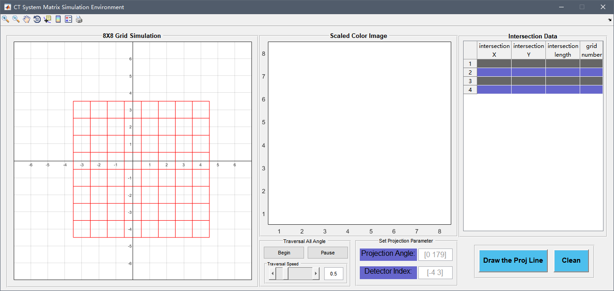

# CT  System Matrix Simulation sample applet

## Table of Contents

* [Background](#Background)
* [Install](#Install)
* [Example](#Example)
	* [How to use](#How-to-use)
* [References](#References)
* [License](#License)

## Background

For most of  CT (Computed Tomography) beginners, it is sometimes difficult to understand the physical meaning of the system matrix and how it is generated or calculated. This applet can help you intuitively understand how the system matrix works and its physical meaning.

The construction of system matrix is influenced by scanning geometry, detector structure, object density function estimation, etc. We can define the weight of the corresponding pixel's contribution to the line integral according to the intensity of the interaction between the ray beam and the pixel of the object (voxel). There are three common modeling methods of system matrix (or projection matrix) :

1. Point model;
2. Line model;
3. Area model.

In this sample, I use the line model, specifically, I use the siddon algorithm to calculate the system matrix (8X8). 

## Install

Just open the "CTProjVisible.m", and then click Run.

## Example

There are three panel:

1. The first is a axes, it has a 8X8 grid that represents 8 pixels;
2. The Scaled Color Image panel, it uses different color to distinguish if a given ray is passing through a specific pixel;
3. The Intersection Data panel, this table lists the length of the given ray intersection with a specific pixel square;

### How to use

* You can set the projection angle and the detector index, then press the button "Draw the Proj Line" to show the intersection of this ray with the pixel.
* You also can press the "Begin" button to traversal all angles.

## References

* [Siddon R L. Fast calculation of the exact radiological path for a three-dimensional CT array[J]. Medical physics, 1985, 12(2):252–255.](https://sci-hub.se/10.1118/1.595715)

## License

[GPL](LICENSE) © Ridge Wong

